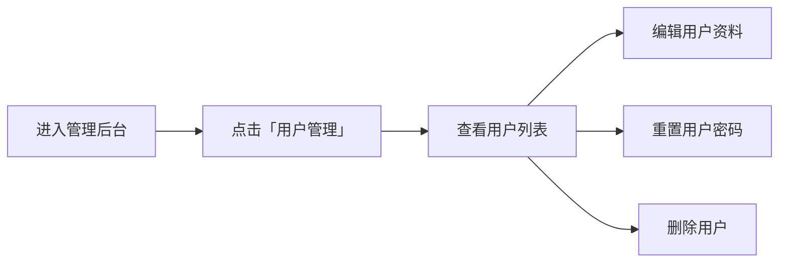

# SmartCS 智能客服系统 — 产品手册

> **版本：** v4.1  
> **更新时间：** 2026-05-21  
> **适用对象：** 管理员、运维人员

---

## 一、产品概述

### 1.1 产品简介

SmartCS 是一款基于 Python Flask 的全功能智能客服工单管理系统，采用「AI 自动应答 + 人工客服」混合模式，支持工单全生命周期管理、多角色权限控制、多渠道集成（企业微信/钉钉）及企业级认证（LDAP/OIDC）。

### 1.2 核心能力

- **智能客服** — 基于知识库的 AI 自动问答，支持 DeepSeek / 通义千问多模型切换
- **工单管理** — 完整生命周期（created → processing → resolved → rated → closed）
- **多角色权限** — 普通用户 / 客服 / 系统管理员 / 安全管理员 / 审计管理员
- **企业集成** — 企微/钉钉消息推送、Jira/禅道缺陷提交、LDAP/OIDC 认证
- **品牌自定义** — 系统名称、主题色、Logo 后台可配
- **移动端** — PWA 支持，可添加到桌面

### 1.3 技术架构

| 层次 | 技术 | 说明 |
|------|------|------|
| 前端 | HTML5 + CSS3 + JavaScript | 原生，无框架依赖 |
| 后端 | Flask 3.0 (Python 3.8+) | 全栈 Web 框架 |
| 数据库 | SQLite 3 (WAL 模式) | 零配置，嵌入式数据库 |
| 反向代理 | Nginx | 静态资源、SSL、负载 |
| AI 引擎 | DeepSeek / 通义千问 | REST API 调用 |

### 1.4 适用场景

- 企业 IT 服务台（ITSM）
- 售后技术支持
- 内部员工服务热线
- 物业/后勤报修

---

## 二、快速上手

### 2.1 环境要求

| 项目 | 最低配置 | 推荐配置 |
|------|---------|---------|
| Python | 3.8 | 3.10+ |
| 内存 | 2 GB | 8 GB |
| 磁盘 | 10 GB | 200 GB SSD |
| 操作系统 | Linux (Ubuntu 20.04+) | Ubuntu 22.04 LTS |

### 2.2 安装部署

```bash
# 1. 克隆或上传项目
cd /opt
git clone https://github.com/Brock-021/smartcs.git
cd smartcs

# 2. 安装依赖
pip install -r requirements.txt

# 3. 启动服务（开发模式）
python app.py

# 4. 访问 http://localhost:5000
```

> 生产环境部署请参考 [DEPLOY.md](../DEPLOY.md)

### 2.3 默认账户

| 角色 | 邮箱 | 密码 |
|------|------|------|
| 超级管理员 | `admin@smartcs.com` | `admin123` |
| 系统管理员 | `sysadmin@smartcs.com` | `SysAdmin@2026` |
| 安全管理员 | `secadmin@smartcs.com` | `SecAdmin@2026` |
| 审计管理员 | `audadmin@smartcs.com` | `AudAdmin@2026` |
| 客服（L1） | `agent@smartcs.com` | `admin123` |

> ⚠️ **生产环境请立即修改默认密码！**

### 2.4 用户端访问

浏览器访问 `http://your-server:8080/`（或通过 Nginx 代理的域名）

1. 点击顶部「登录」→ 注册账号
2. 在聊天框输入问题，AI 自动回答
3. 需要人工时，点击「转人工」按钮
4. 问题解决后，评价服务

---

## 三、功能详述

### 3.1 💬 智能客服（用户端）

#### AI 自动问答

用户发送消息后，系统使用知识库内容生成 AI 回复。支持多轮对话，AI 无法回答时提示转人工。

**功能入口：** `/`（首页）

#### 图片上传

支持拍照或从相册选择图片发送，图片上传至 `uploads/` 目录。

#### 转人工

用户点击「转人工」后，工单从 `created` → `processing`，出现在客服待处理列表。

#### 工单评价

客服提请处理完成后，用户可确认解决并评分（1-5 星）。

### 3.2 📋 客服工作台

**访问路径：** `/agent/dashboard`

#### 工单列表

| 标签 | 说明 |
|------|------|
| ❇️ 待处理 | processing 状态、未受理的工单 |
| 👤 我的客户 | 已分配给当前客服的工单 |
| 📋 历史工单 | 已完成的工单 |

#### 工单处理流程

```
created → processing → resolved → rated → closed
                          ↓ 用户不确认
                     超时自动进 rated
```

1. **接单** — 点击工单自动受理（状态→processing）
2. **回复** — 输入消息后发送
3. **提请处理完成** — 问题解决后点击（状态→resolved）
4. **关闭工单** — 用户评价后填写备注关闭（状态→closed）

#### 辅助功能

- **升级工单** — 转给更高级别客服
- **提交缺陷** — 一键提交 Jira/禅道
- **提交知识** — 将解决方案沉淀为知识

### 3.3 ⚙️ 管理后台

**访问路径：** `/admin/dashboard`（需管理员账号登录）

管理后台按标签页组织，以下逐一介绍：

---

#### 📋 工单管理

查看、搜索全部工单，支持按状态筛选。管理员可强制关闭任意状态工单，支持 CSV 导出。

**操作权限：** 系统管理员、超级管理员

---

#### 📊 数据统计

工单趋势图、客服排行、满意度统计、工单状态分布。

**操作权限：** 系统管理员、安全管理员、审计管理员、超级管理员

---

#### 👥 用户管理

管理注册用户（增删改查、重置密码）。

**操作权限：** 系统管理员、超级管理员

---

#### 👤 客服管理

管理客服账号（增删改查、级别设置）。客服等级支持 L1~L4，可自定义级别名称。

- 添加客服时可选级别
- 级别名称可在系统配置中自定义
- 删除客服由安全管理员负责

**操作权限：** 增/改 → 系统管理员；删除 → 安全管理员

---

#### ⚙️ 系统配置

| 配置项 | 说明 | 默认值 |
|--------|------|--------|
| API 地址 | AI 模型 API 地址 | `https://api.deepseek.com/v1` |
| API 密钥 | AI 模型 API Key | 空 |
| 模型名称 | AI 模型名称 | `deepseek-chat` |
| 管理员密码 | 管理员登录密码 | `admin123` |
| Webhook 超时 | Webhook 请求超时(秒) | `10` |
| 自动关闭时间 | 已创建超时自动关闭(分钟) | `20` |
| 自动评价时间 | 已处理超时自动评价(小时) | `24` |
| 工单搜索天数 | 客服可搜索的最大天数 | `365` |
| 级别名称 | 各级别显示名称（JSON） | 初级/高级/专家/首席工程师 |

**操作权限：** 系统管理员、超级管理员

---

#### 🏷️ 关闭原因

自定义工单关闭原因标签（CRUD + 排序）。

**操作权限：** 系统管理员、超级管理员

---

#### 📋 系统升级

记录系统升级日志。

**操作权限：** 系统管理员、超级管理员

---

#### 🔧 负责系统

配置服务目录/系统列表，分配工程师负责的系统。

**操作权限：** 系统管理员、超级管理员

---

#### 🔗 集成网关

管理外部系统对接（企业微信、钉钉、Jira、禅道、Webhook）。

**操作权限：** 系统管理员、超级管理员

---

#### 🔐 认证管理

LDAP / OIDC 认证提供商配置。

**操作权限：** 安全管理员、超级管理员

---

#### 📋 审计日志

全量操作审计记录，支持按操作人、操作类型、日期筛选。包含 IP 地址记录。

**操作权限：** 审计管理员、超级管理员

---

#### 🎨 品牌配置 ⭐️（v4.1 新增）

管理员可实时修改系统外观：

| 配置项 | 说明 | 默认值 |
|--------|------|--------|
| 品牌名称 | 页面标题、PWA 名称 | `SmartCS 智能客服` |
| 品牌简称 | 短名称显示 | `SmartCS` |
| 主题色 | 全站主色调（CSS 变量） | `#1a73e8` |
| Logo 路径 | 页面 Logo 图片路径 | `/static/icon-192.png` |
| Favicon 路径 | 浏览器标签图标 | `/static/favicon.ico` |

**生效范围：**
- 所有页面标题
- PWA manifest.json（添加到桌面的名称和主题色）
- Service Worker 缓存名称
- 所有按钮、链接、导航栏颜色
- 页面 Logo 区域

**操作权限：** 系统管理员、超级管理员

**操作步骤：**
1. 进入「品牌配置」标签页
2. 修改品牌名称、主题色（支持色值如 `#ff6600`）
3. 点击「保存配置」
4. 修改即时生效，无需重启服务

---

#### 🔒 安全配置 ⭐️（v4.1 新增）

管理员可自定义安全策略：

| 配置项 | 说明 | 默认值 |
|--------|------|--------|
| 密码最小长度 | 客服密码最少字符数 | `8` |
| 密码要求大写 | 是否要求包含大写字母 | `true` |
| 密码过期天数 | 密码有效天数 | `90` |
| 登录最大尝试次数 | 连续失败锁定前的次数 | `5` |
| 登录锁定时间 | 锁定持续时间(分钟) | `15` |
| 审计日志保留天数 | 审计日志自动清理天数 | `365` |

**操作权限：** 安全管理员、超级管理员

**操作步骤：**
1. 进入「安全配置」标签页
2. 修改各项策略值
3. 点击「保存配置」
4. 密码策略即时生效于新密码设置

---

### 3.4 📚 知识库管理

**访问路径：** `/upload`

上传、编辑、删除知识文档。支持格式：Word (.docx)、PDF、PPT、Markdown、TXT。AI 自动学习知识库内容用于回复。

**操作权限：** 系统管理员、超级管理员

---

## 四、配置指南

### 4.1 系统配置文件

所有配置持久化存储在 `system_config` 表中，通过管理后台可视化编辑。

### 4.2 配置分类

| 分类 | 管理位置 | 管理员角色 | 包含配置项 |
|------|---------|-----------|-----------|
| 系统配置 | ⚙️ 系统配置 | 系统管理员 | AI 模型、API Key、超时参数 |
| 品牌配置 | 🎨 品牌配置 | 系统管理员 | 品牌名称、主题色、Logo |
| 安全配置 | 🔒 安全配置 | 安全管理员 | 密码策略、登录限制 |
| 系统行为 | 自动设置 | — | 会话超时、分页大小 |

#### 系统行为配置（无需后台管理界面，自动从 `system_config` 读取）

| 配置键 | 说明 | 默认值 |
|--------|------|--------|
| `session_lifetime` | 会话生命周期（秒） | `28800`（8小时） |
| `session_idle_timeout` | 空闲超时（秒） | `1800`（30分钟） |
| `auto_check_interval` | 自动检查间隔（秒） | `300` |
| `pagination_per_page` | 分页大小 | `50` |
| `max_upload_size_mb` | 上传文件大小限制（MB） | `50` |

### 4.3 环境变量

| 变量 | 说明 | 默认值 |
|------|------|--------|
| `DASHSCOPE_API_KEY` | 通义千问 API Key | 空（使用 DeepSeek） |
| `API_BASE_URL` | AI 模型 API 地址 | `https://api.deepseek.com/v1` |
| `MODEL_NAME` | 模型名称 | `deepseek-chat` |
| `ADMIN_PASSWORD` | 管理员公共密码 | `admin123` |
| `SECRET_KEY` | Flask Session 密钥 | `smart-cs-secret-2026` |

---

## 五、管理员操作指南

### 5.1 日常巡检

| 频率 | 操作 |
|------|------|
| 每日 | 查看待处理工单数量 |
| 每日 | 检查知识库是否需要更新 |
| 每周 | 查看客服工单统计 |
| 每周 | 检查审计日志 |
| 每月 | 检查系统配置是否需要调整 |

### 5.2 用户管理



### 5.3 客服管理


### 5.4 品牌自定义

1. 以系统管理员身份登录管理后台
2. 点击「🎨 品牌配置」标签
3. 输入品牌名称（如「XX公司 IT 服务台」）
4. 选择主题色（输入 hex 颜色值，如 `#1890ff`）
5. 设置 Logo 图片路径
6. 点击「保存配置」
7. 刷新页面即可看到新品牌效果

### 5.5 安全策略配置

1. 以安全管理员身份登录管理后台
2. 点击「🔒 安全配置」标签
3. 设置密码最小长度（建议 ≥ 8）
4. 开启/关闭大写字母要求
5. 设置密码过期天数（建议 90 天）
6. 配置登录失败锁定策略
7. 点击「保存配置」

### 5.6 备份与恢复

**备份数据库：**
```bash
sqlite3 /path/to/data/smartcs.db ".backup /backup/smartcs_$(date +%Y%m%d).db"
```

**恢复数据库：**
```bash
sqlite3 /path/to/data/smartcs.db ".restore /backup/smartcs_20260521.db"
```

### 5.7 查看审计日志

1. 以审计管理员身份登录管理后台
2. 点击「审计日志」标签
3. 可按操作人、操作类型、日期范围筛选
4. 日志详情包含操作时间、操作人、操作类型、详情、IP 地址

---

## 六、常见问题

### Q1: 管理员密码忘记怎么办？

直接编辑 `system_config` 表中的 `admin_password` 值，或通过数据库命令行修改：

```sql
sqlite3 data/smartcs.db
UPDATE system_config SET value='new_password' WHERE key='admin_password';
UPDATE agents SET password_hash=sha256_hash('admin:new_password') WHERE email='admin@smartcs.com';
```

### Q2: 主题色修改后部分页面未生效？

请强制刷新浏览器缓存（Ctrl+Shift+R 或 Cmd+Shift+R）。如果仍有问题，重启 Nginx 清除缓存。

### Q3: 如何切换 AI 模型？

在管理后台「系统配置」中修改 API 地址、API Key 和模型名称。支持 DeepSeek、通义千问等兼容 OpenAI 接口的模型。

### Q4: 工单状态不流转怎么办？

系统会每分钟自动检查超时工单。如需手动干预，管理员可在后台「工单管理」强制关闭。

### Q5: 用户无法注册？

确保用户端可见，默认无需管理员开启。如有 SSO 需求，请配置认证提供者。

### Q6: 新增安全配置后客服无法登录？

检查新密码是否符合密码策略（最小长度、大写要求等）。登录锁定后需等待锁定时间自动解除，或管理员在数据库中直接解锁。

### Q7: 审计日志占用空间过大？

可在「安全配置」中调整 `audit_log_retention_days`（审计日志保留天数），到期日志自动清理。

### Q8: 如何升级系统？

1. 备份数据库
2. 替换新版 `app.py` 和模板文件
3. 重启服务：`systemctl restart smartcs`
4. 查看「系统升级」标签页确认版本

### Q9: 知识库上传后 AI 不识别？

检查知识文件格式是否支持（.docx/.pdf/.ppt/.md/.txt），以及文件内容是否有足够的关键词供 AI 匹配。

### Q10: PWA 添加后名称/主题色不对？

PWA 的 manifest.json 和 Service Worker 动态从数据库读取品牌配置。清除浏览器缓存后重新添加到桌面。

---

## 七、附录

### 7.1 文件结构

```
smartcs/
├── app.py                    # 主应用（~4750行）
├── test_smartcs.py           # 集成测试
├── test_smartcs_full.py      # 全功能集成测试
├── test_roles.py             # 三员权限测试
├── requirements.txt          # Python 依赖
├── README.md                 # 项目文档
├── DEPLOY.md                 # 部署手册
├── USAGE.md                  # 使用说明
├── CHANGELOG.md              # 版本历史
├── architecture.md           # 架构详解
├── static/
│   └── icon-192.svg          # PWA 图标
├── templates/
│   ├── chat.html             # 用户聊天首页
│   ├── admin.html            # 管理员后台
│   ├── agent_dashboard.html  # 客服工作台
│   ├── agent_login.html      # 客服登录页
│   └── upload.html           # 知识库管理页
├── knowledge/                # 知识库文件
├── docs/                     # 文档
├── data/                     # 运行时数据
└── tests/                    # 扩展测试
```

### 7.2 数据库表

核心表：`service_tickets`, `conversations`, `messages`, `customers`, `agents`, `agent_profiles`, `audit_log`, `knowledge_files`, `system_config`, `close_reasons`, `systems`, `im_adapters`, `external_adapters`, `webhooks`, `auth_providers`

配置表：`system_config`（key-value 存储所有系统配置）

### 7.3 联系方式

- GitHub 仓库：`https://github.com/Brock-021/smartcs`
- 部署服务器：`生产服务器`
- 文档维护人：旺财

---

> **文档版本：** v1.0  
> **最后更新：** 2026-05-21  
> **适用版本：** SmartCS v4.1
